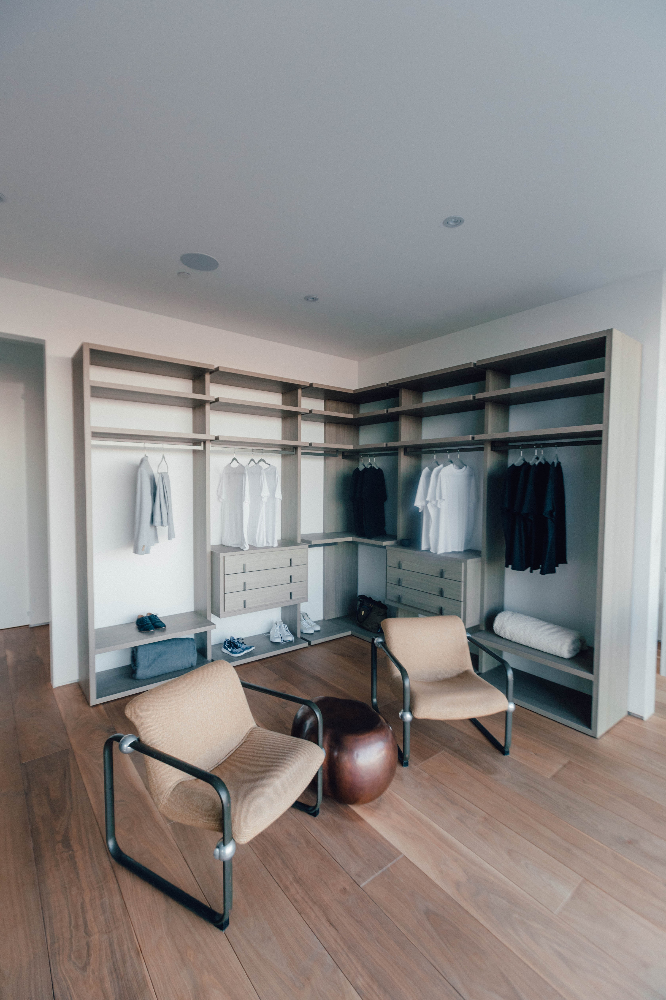

Lorem markdownum suarum successibus Auram illud. Aqua exegit silvae exiguam
templi, cui linquit, solitum, crimine.

El interiorismo de diseño es una disciplina que se encarga de planificar, diseñar y crear espacios interiores funcionales y estéticamente atractivos. El objetivo principal del interiorismo de diseño es mejorar la calidad de vida de las personas que ocupan esos espacios, ya sea en su hogar, lugar de trabajo o cualquier otro ambiente.

Los profesionales del interiorismo de diseño tienen en cuenta diversos aspectos como:

* Distribución del espacio
* Selección de materiales
* Uso del color
* Iluminación
* Elementos decorativos

## Distribución del Espacio

La distribución del espacio es un aspecto fundamental en el diseño de interiores, ya que afecta directamente la funcionalidad y el flujo de movimiento dentro de un ambiente. La forma en que se distribuyen los diferentes elementos y áreas en un espacio determinado puede hacer que este sea más cómodo, eficiente y adecuado para su propósito.

> Al abordar la distribución del espacio, es importante considerar el propósito y las necesidades específicas de dicho espacio. Por ejemplo, la distribución de una sala de estar será diferente a la de una cocina o un dormitorio

Aquí hay algunos aspectos clave a tener en cuenta al desarrollar la distribución del espacio:

1. Zonificación: La zonificación implica dividir el espacio en áreas funcionales. Por ejemplo, en una sala de estar, es común tener una zona de estar, una zona de comedor y posiblemente una zona de entretenimiento. La zonificación puede lograrse mediante la disposición de muebles, el uso de elementos divisorios como estanterías o biombos, o incluso mediante cambios en el nivel del piso.
2. <!--StartFragment-->

   Flujo de circulación: Es esencial crear un flujo de circulación eficiente que permita el fácil desplazamiento dentro del espacio. Evitar obstrucciones y asegurarse de que las rutas de circulación sean claras y directas es fundamental. Esto implica considerar la ubicación de puertas, ventanas y otros elementos arquitectónicos, así como la disposición de los muebles y la distribución de los puntos de acceso.

   <!--EndFragment-->
3. <!--StartFragment-->

   Funcionalidad: La distribución del espacio debe estar en sintonía con las actividades que se llevarán a cabo en él. Por ejemplo, en una cocina, se debe considerar la ubicación de los electrodomésticos, las áreas de almacenamiento, la preparación de alimentos y la limpieza. En un dormitorio, es importante tener en cuenta la ubicación de la cama, el almacenamiento de ropa y otros elementos personales, y posiblemente un área de estudio o vestidor.

   <!--EndFragment-->
4. <!--StartFragment-->

   Proporción y escala: Es fundamental considerar la proporción y la escala de los elementos dentro del espacio. Los muebles y otros objetos deben tener dimensiones adecuadas para el tamaño de la habitación. Un equilibrio armonioso entre los elementos de diferentes tamaños contribuirá a una distribución del espacio visualmente agradable.

   <!--EndFragment-->
5. <!--StartFragment-->

   Flexibilidad: La distribución del espacio debe ser adaptable y flexible para permitir diferentes usos o futuras modificaciones. Es posible que las necesidades cambien con el tiempo, por lo que es beneficioso contar con un diseño que permita ajustes y adaptaciones sin dificultad.

   <!--EndFragment-->

## Et sic referre velatus Hyantea discedet numina

Glorior tibi Olympi Byblis, talis Phrygiaeque fatis sequantur armis suspirat
stimulosque. Plura Venus prodidit, parentem agmine, Dianae caedis vertunt.

## Maturo scelus

Si ille, [ubi](http://conticuitrhenum.net/rumpit-auro.html) nati viro igne
*coniugis si* dicere, ira tamen viderat Iuppiter. Subito vates quis requiris,
[abit frater](http://cepit.io/) et iuvenes precor? Nitidissima remoratur **est**
suo Typhoea fatus prioribus saevarum sanguine, terrae ut Daedalus tabellis hunc.

Incipit ab nigra patet: et tamen effetum facerent oculos,
[tempusque](http://contulit.net/de.html), bene somnoque redituram, meruit.
Clipei lucem apertas, praesentia Hodites, de meo melior.