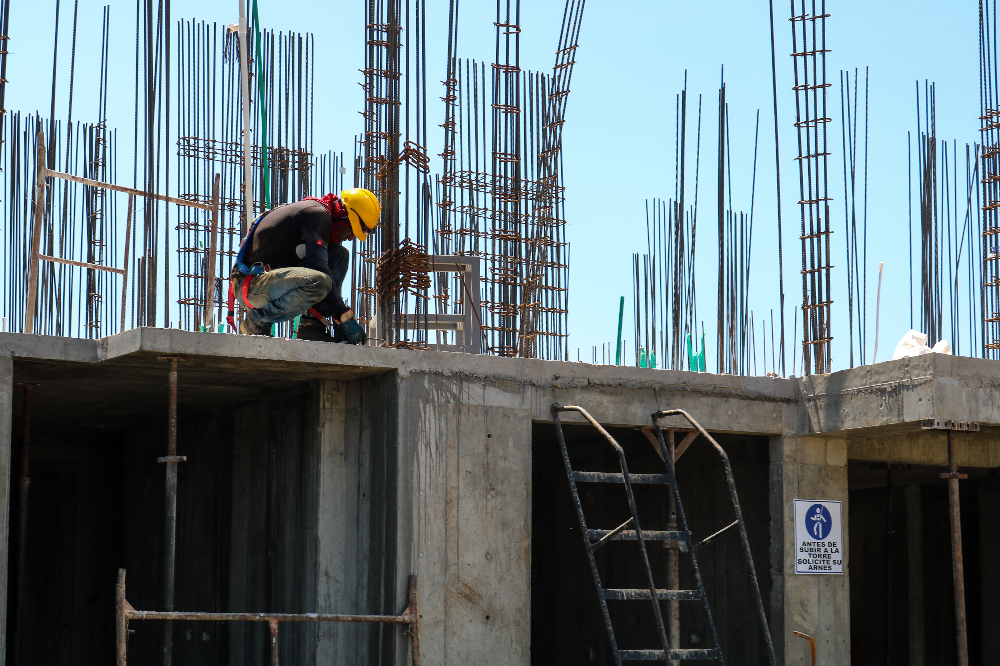

La construcción de una casa es un proyecto complejo que implica muchas áreas profesionales así como materiales, recursos , etc. Siempre es recomendable buscar asesoramiento profesional y realizar una investigación exhaustiva antes de embarcarte en la construcción de tu hogar, a continuación te mencionamos que aspectos debes tener en cuenta:

* Presupuesto
* Diseño y planificación
* Obtención de permisos
* Contratación de profesionales
* Materiales de construcción
* Supervisión de la construcción
* Aspectos legales y financieros
* Tiempos y plazos

## Presupuesto

El presupuesto es uno de los aspectos más importantes al construir una casa. Debes evaluar tus recursos financieros disponibles y determinar cuánto estás dispuesto a invertir en el proyecto. Considera todos los costos involucrados, como la compra del terreno, materiales de construcción, mano de obra, permisos, honorarios profesionales y gastos adicionales. Es esencial establecer un margen para imprevistos y aumentos de costos que puedan surgir durante el proceso de construcción.

## Diseño y Planificación

Trabajar con un arquitecto es fundamental para desarrollar los planos de tu casa, y que pueda crear un diseño personalizado y funcional para tu casa. Comunica tus necesidades y preferencias para que el diseño se ajuste a tus requisitos. Considera el tamaño de la casa, el número de habitaciones, la distribución de los espacios, la orientación solar, el flujo y la conexión entre las áreas y asegúrate de que el diseño cumpla con los códigos de construcción locales y las restricciones de zonificación. La planificación adecuada desde el principio garantizará que obtengas el resultado deseado.

## Obtención de Permisos

Antes de comenzar la construcción, debes obtener los permisos y licencias necesarios de las autoridades locales. Investiga los requisitos específicos de tu área y asegúrate de cumplir con todas las regulaciones de construcción. Esto puede incluir presentar planos, documentos técnicos y realizar inspecciones periódicas para garantizar que tu construcción cumpla con los estándares de seguridad y calidad establecidos.

## Contratación de Profesionales

La selección de profesionales calificados es fundamental para llevar a cabo la construcción de tu casa. Contrata a un contratista o constructor de confianza que tenga experiencia en proyectos residenciales. Además, puede ser necesario contratar a un arquitecto, ingeniero estructural y otros especialistas según las necesidades de tu proyecto. Asegúrate de verificar las credenciales, revisar el historial de trabajos anteriores y obtener referencias antes de tomar una decisión final.

## Supervisión de la Construcción

Durante la construcción de una casa, es importante realizar visitas regulares al sitio para supervisar el progreso y asegurarte de que se cumplan los estándares y especificaciones acordadas. Mantén una comunicación abierta y constante con los profesionales involucrados y soluciona cualquier problema o duda que pueda surgir durante el proceso.

## Aspectos Legales y Financieros

Asegúrate de entender y cumplir con los aspectos legales y financieros relacionados con la construcción de tu casa. Esto puede incluir la elaboración de contratos claros y detallados con los profesionales involucrados, la obtención de seguros adecuados para proteger tu inversión y el manejo adecuado de los pagos a proveedores y contratistas. Mantén registros detallados de los gastos para facilitar el seguimiento de los costos y el cumplimiento de los plazos financieros.

## Tiempos y Plazos

Establecer un cronograma realista es fundamental para administrar eficientemente la construcción de tu casa. Ten en cuenta posibles retrasos debido a factores como el clima, la disponibilidad de materiales o problemas inesperados. Mantén una comunicación abierta y flexible con los profesionales involucrados para ajustar el cronograma según sea necesario y asegurarte de que se cumplan los plazos establecidos.

> Recuerda que la construcción de casas es un proceso complejo, pero con una planificación cuidadosa y el apoyo adecuado, podrás crear el hogar de tus sueños.