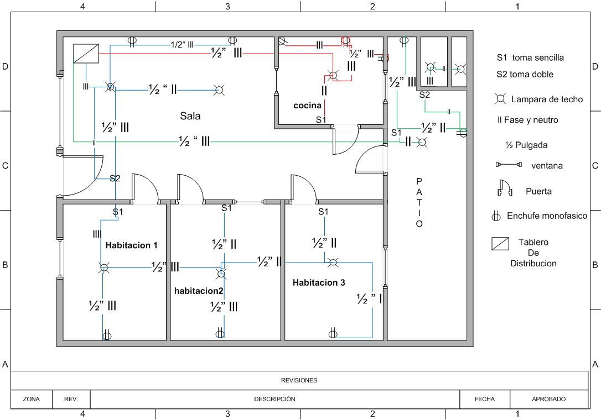

Los planos de una casa son representaciones gráficas y detalladas de la distribución y diseño de una vivienda. Son documentos esenciales en el proceso de construcción o remodelación de una casa, ya que proporcionan una visión clara y precisa de cómo será la estructura final.

> Los planos de casas incluyen información vital, como las dimensiones de cada habitación, la ubicación de las paredes, ventanas y puertas, así como la disposición de los espacios interiores y exteriores. También pueden mostrar características adicionales como escaleras, patios, terrazas o garajes.

Sin importar las dimensiones de la infraestructura, los planos de casas pequeñas o de gran tamaño suelen ser elaborados por profesionales en el campo de la arquitectura. El arquitecto, teniendo en cuenta las necesidades y preferencias del cliente en un diseño arquitectónico, así como las regulaciones y requisitos locales de construcción, es el encargado de diseñar y crear el plano de una casa.

Existen varios tipos de planos de casas que se utilizan con diferentes propósitos. Entre ellos se encuentran:

1. Planos de planta: Estos planos ofrecen una vista aérea de la distribución de los espacios en una sola planta. Muestran la ubicación de cada habitación, pasillos y áreas comunes, permitiendo visualizar cómo se conectan los diferentes espacios.

   
2. Planos de fachada: Estos planos se enfocan en la representación de la fachada de la casa. Muestran la disposición de las ventanas, puertas, revestimientos exteriores y elementos arquitectónicos, brindando una vista frontal de cómo se verá la casa desde el exterior.
3. Planos de elevación: Los planos de elevación proporcionan vistas en 2D de cada uno de los lados de la casa. Estos planos permiten visualizar cómo se verá la casa desde diferentes ángulos y ayudan a comprender la altura y proporciones de la estructura.
4. Planos de instalaciones: Estos planos se centran en los aspectos técnicos de la casa, como la ubicación de la electricidad, fontanería, calefacción, ventilación y sistemas de aire acondicionado. Proporcionan información detallada para los profesionales encargados de instalar estos sistemas.

   

Los planos de la casa son herramientas fundamentales tanto para los propietarios como para los constructores. Para los propietarios, los planos les permiten visualizar cómo será su futura vivienda y tomar decisiones informadas sobre la distribución de los espacios y la personalización de los acabados. Para los constructores, los planos son la guía principal durante la construcción, asegurando que se sigan las especificaciones y se logre la visión del diseño original.

Hoy en día, gracias a los avances tecnológicos, los planos de casas modernas se crean utilizando software de diseño asistido por computadora (CAD) y herramientas de modelado en 3D, actualmente los diseños de casas se elaboran cada vez más usando estas tecnologías. Esto facilita la visualización más realista de los espacios y permite realizar modificaciones de manera más eficiente.