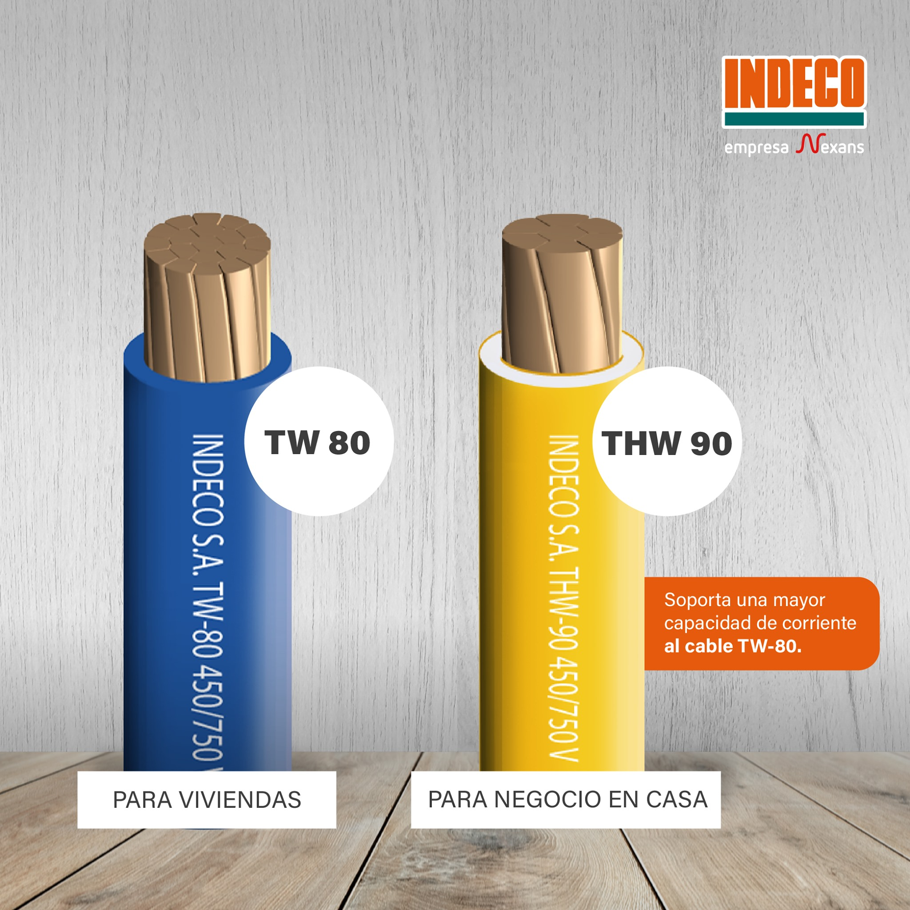

## La selección del cable o conductor eléctrico es una parte fundamental en la instalación eléctrica de una casa, instalar un cable de calidad evitará que tu vivienda pueda correr riesgos de cortocircuito o incendios.

> Los mejores conductores eléctricos son los que están fabricados con cobre o tienen mayor 
> pureza de cobre en Perú las marcas más reconocidas son **Indeco, Celsa, Elcope y Brande**. 

## ¿ Cual es el tipo de cable que se usa para Casa?

En Perú existen 2 tipos de cables recomendados para una instalación doméstica.

* Cable TW 80 (Thermoplastic Wire)
* Cable THW 90 (Thermoplastic Heat and Water-resistant)

Estos dos tipos de cables eléctricos son los más comunes en el sector residencial.

## Cable TW 80 °

El cable TW es un tipo de cable eléctrico con aislamiento de PVC (cloruro de polivinilo) termoplástico. Está diseñado para aplicaciones residenciales y comerciales ligeras. Los cables TW son generalmente utilizados para la distribución de energía en circuitos de iluminación y tomas de corriente. Son adecuados para instalaciones en interiores y en lugares secos.

## Cable THW 90 °

El cable THW también tiene un aislamiento de PVC termoplástico, pero además cuenta con una capa adicional de aislamiento resistente al calor y al agua. Esto lo hace más adecuado para instalaciones en exteriores y en lugares húmedos. Los cables THW se utilizan en aplicaciones residenciales y comerciales donde se requiere una mayor resistencia al calor y a la humedad.

Como vemos en la imagen del fabricante Indeco, hace una clasificación para viviendas y negocios en casa, considerando que este ultimo tiene un mayor consumo, pero ciertamente ambos conductores eléctricos, cable TW y cable THW sirven para el cableado eléctrico de una casa, pero es más común encontrar el TW debido a que tiene un costo menor al THW al menos la marca Indeco, porque otros fabricantes como Celsa ( Conductores eléctricos Lima SA ) o Elcope ( Electroconductores Peruanos ) ofrecen el THW 90 al mismo precio que un TW 80. 

## ¿Que número de Cable usar en una Instalación Domiciliaria?

Determinar el calibre del conductor adecuado a utilizar en una instalación es muy importante, para calcular la sección del cable, es necesario considerar varios factores, como la carga eléctrica prevista, la longitud del cable( caída de tensión) y la capacidad de corriente que el cable debe soportar sin sobrecalentarse, dicho cálculo debe ser realizado por un electricista o especialista,  quien debe determinar el número adecuado para cada instalación.

Actualmente en el Perú dadas las dimensiones y consumos eléctricos de la mayoría de viviendas los conductores eléctricos más utilizados son: **cable calibre 14 AWG y el cable calibre 12 AWG** para los circuitos de interruptores y tomacorrientes, respectivamente.

A continuación dejamos una tabla de capacidad de corriente de estos cables según uno de los principales fabricantes:

| TIPO   | CALIBRE / NUMERO | MARCA  | CAPACIDAD (A) |
| ------ | ---------------- | ------ | ------------- |
| TW 80  | \    14 AWG      | INDECO | 22 amperios   |
| THW 90 | \    14 AWG      | INDECO | 25 amperios   |
| TW 80  | \    12 AWG      | INDECO | 28 amperios   |
| THW 90 | \    12 AWG      | INDECO | 30 amperios   |

*La capacidad de corriente en esta tabla es la estimada cuando se pasa por una tubería o ducto. Si desea ver más características técnicas u otros calibres de conductores entre aquí.*

¿Y porque se utiliza tanto estos cables? Pongamos un ejemplo, uno de los electrodomésticos común en casa y que tiene un alto consumo es una lavadora que dependiendo de la marca y tamaño puede tener una potencia de entre 1500 a 2500 Watts, esta potencia traducida en amperios sería entre 7 y 12 amp. como máximo y como vemos en la tabla un cable indeco 14 AWG soporta 22a, y un cable indeco 12 AWG soporta 28a, ambos conductores tienen una capacidad superior al consumo de esta lavadora, ahora obviamente se debe tener en cuenta que muchos electrodomésticos pueden ser utilizados simultáneamente, pero aún así estos calibres de conductores 14 AWG y 12 AWG ofrecen un gran margen de capacidad para una instalación doméstica, por eso son los calibres de cable que más del 90% utiliza en instalaciones residenciales.

Por último se debe tener mucho cuidado con los cables imitaciones que existen en el mercado, si quieres saber como reconocer un cable indeco original te recomiendo este post.